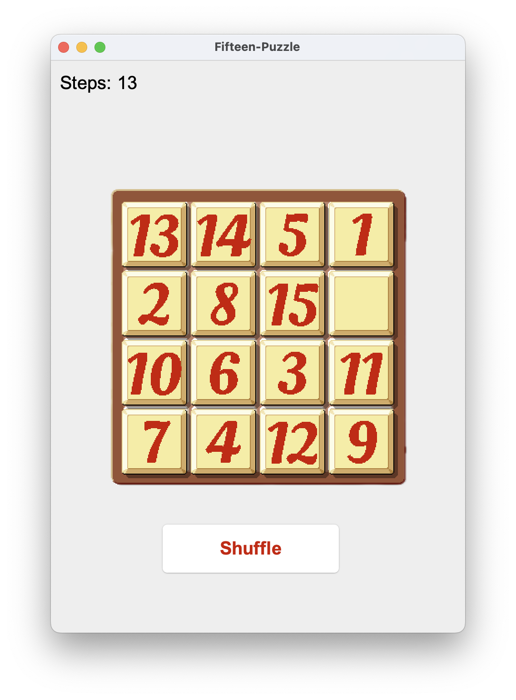

# Fifteen Puzzle Game

A classic **Fifteen Puzzle** game implemented with a graphical user interface in Java Swing. The game challenges players to arrange numbered tiles in ascending order by sliding tiles into an empty space.

## Game Rules

1. The puzzle consists of a 4x4 grid containing 15 numbered tiles and one empty space.
2. Use arrow keys to move tiles adjacent to the empty space.
3. The objective is to arrange the tiles in ascending order, from left to right and top to bottom, with the empty space in the bottom-right corner.

## Features

- **Shuffling Algorithm**  
  The game uses the **Fisher-Yates algorithm** to shuffle the puzzle tiles, ensuring a well-distributed initial state.

- **Guaranteed Solvability**  
  After shuffling, the game checks the solvability of the grid using inversion count and blank tile row position logic. If the grid is unsolvable, it is adjusted to guarantee a solvable configuration.

## Planned Features

- **Steps to Solve**  
  Calculates the minimum number of moves required to solve the current puzzle, helping players track progress and strategize their moves.

- **Optimal Solution**  
  Integration of an algorithm (e.g., A* search) to compute the shortest sequence of moves to solve the puzzle.

## Game Preview

Here’s a preview of the Fifteen Puzzle game interface:

## Resources

This project uses modified image assets originally sourced from OpenGameArt.org's [2048 Board and Tiles](https://opengameart.org/content/2048-board-and-tiles).  
- **Author**: Vircon32 (Carra)  
- **License**: [CC-BY 4.0](https://creativecommons.org/licenses/by/4.0/)  
- The images have been adapted to meet the visual requirements of this project.

---

Feel free to contribute by suggesting features, reporting bugs, or optimizing the existing functionality!
